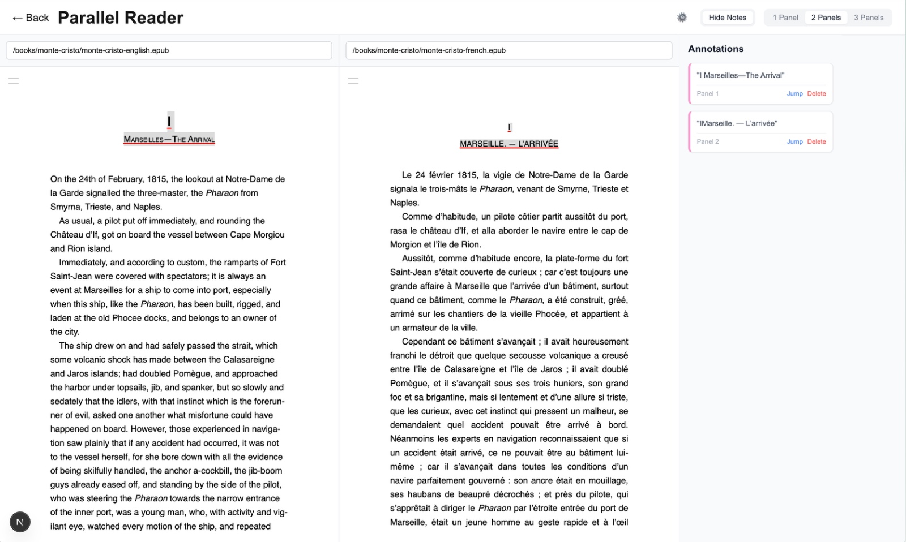

<table>
  <tr>
    <td width="60%">
      
<b>React Parallel Reader</b> is a browser based epub reader that allows reading epubs side by side.

      
It stems from my desire to read translations alongside with originals, and to compare different versions of the same book.

      
This project is based on react, next.js, react-reader and epub.js. css is in sass.
      
    </td>
    <td width="40%">
      
    </td>
  </tr>
</table>

## Features

* offline first - books and annotations are stored locally
* continuous scrolling - no page turning - makes sure you can line up the same sentence in different languages
* annotations and highlights - highlight text and save as an annotation - pick color or underline - add notes - jump to highlight
* soon - link annotations - allows linking two annotations so that you can pair up book sections and jump to the section in both books at the same time. 

## How to Use

1. clone or fork the project
2. add books
3. npm run dev, open http://localhost:3000 in your browser, start using.

check docs folder for roadmap/issues.

### Adding Books (Dynamic Bookshelf)

The app connects to the `public/books/` directory. Typically, you will create a subfolder for each "collection" or "comparison set".

1.  **Create a folder**: `public/books/my-comparison/`
2.  **Add EPUBs**: Drop your `.epub` files into that folder.
3.  **Refresh**: Reload the page. Your new collection will appear in the Bookshelf list.

### Reading

- Click a collection card to open the **Parallel Reader**.
- Use the **Panel Controls** (1, 2, 3) to adjust the number of visible panels.
- Paste a URL or let the bookshelf autoload your files.
- Click **← Back** to return to the library.

## Customization

### Editing Highlight Styles

Highlights are rendered as SVG overlays on top of the text.

1.  **Base Styles (Opacity, Blending):**
    *   Edit `app/globals.css`.
    *   Look for `.hl-highlight` and `.hl-underline` classes at the bottom of the file.
    *   Here you can change `fill-opacity`, `mix-blend-mode` for hl-highlight
    *   `fill`, `stroke opacity`, `stroke`, `stroke-width`, `stroke-linecap` for hl-underline
        ( i'm not sure if all of these work but i got to an acceptable point)

2.  **Highlight Colors:**
    *   Colors are defined in the `HighlightMenu` component and applied dynamically.
    *   The application logic for applying these colors is in `app/components/ParallelReader.tsx`.

3.  Preexisting highlights have their colors stored in the highlights.json file. 
